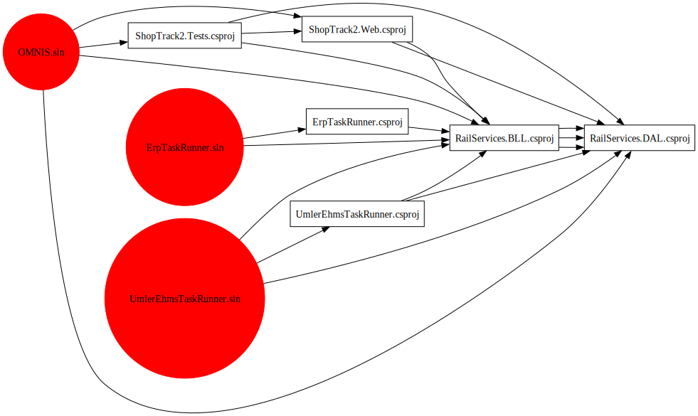

# CC.SolutionsAnalyzer
Dependency-free tool that parses solutions, projects, and dependency/packages from a source directory.  Used to investigate a large code base with hundreds of projects and dozens of solutions sharing projects.  

# Sample Usage
The tool builds out a list of solutions that could be used to generate solution project dependency graph using [Graphviz](https://graphviz.org/) like this:

Diagram was generated using this [sample app](https://github.com/chrcar01/CC.SolutionsAnalyzer/tree/main/samples/GraphvizDemo).
